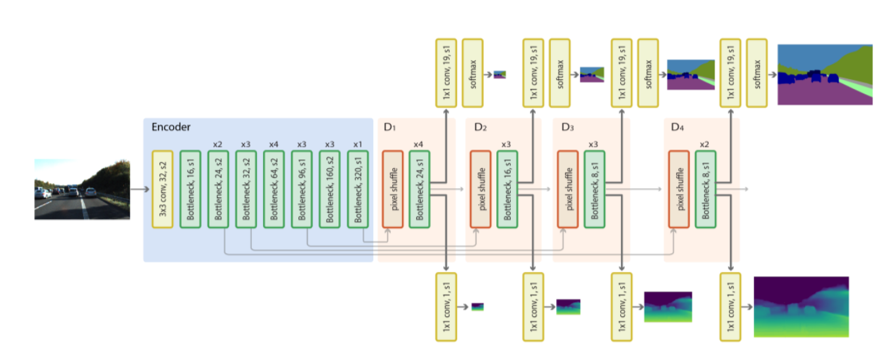
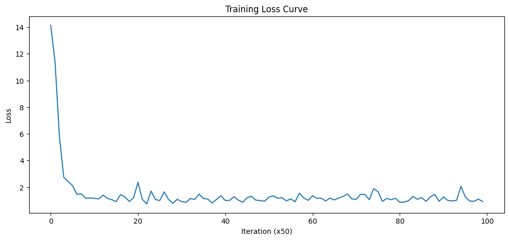
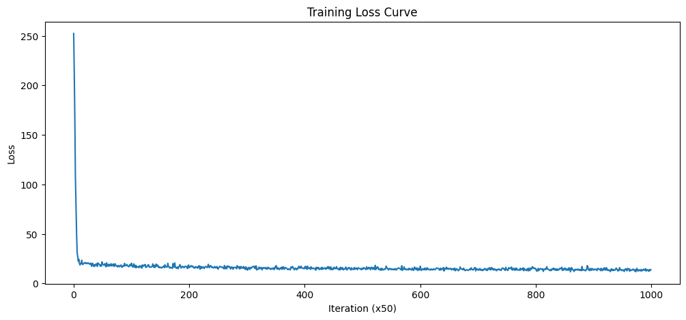
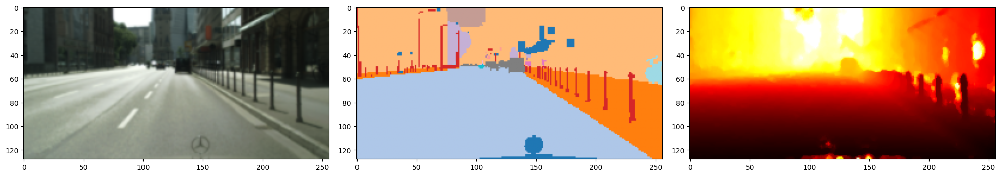
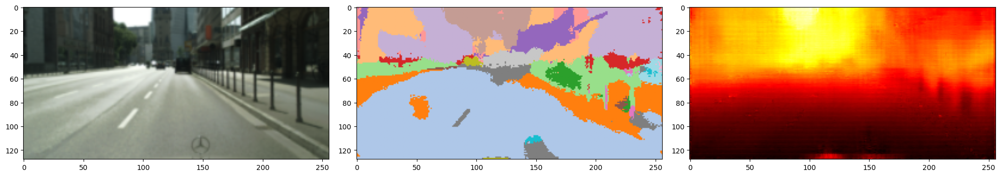

# Depth-Estimation-Task
This project is my implementation of a Lightweight Depth Estimation Model from scratch in Pytorch following the architecture provided this [ICLR paper](https://ieeexplore.ieee.org/document/9411998).

It's using the frozen [MobileNetV2](https://github.com/d-li14/mobilenetv2.pytorch) encoder and trains a Decoder composed of [Inverted Residual](https://ieeexplore.ieee.org/document/8578572) Blocks from the MobileNetV2 network. A U-net style architecture is followed. 
### Model Architecture


### Datasets and Training:
- Training was done on an HP-Omen Laptop with RTX 4060 GPU.
- Due to limited compute resources I am using low-resolution version of the KITTI and CityScapes dataset.
- Download the datasets:
    - [KITTI](https://www.kaggle.com/datasets/utsabkaran/kitti-data)
    - [CityScapes](https://www.kaggle.com/datasets/sakshaymahna/cityscapes-depth-and-segmentation)

---

### Training Loss
<figure>

<figcaption>Loss on KITTI and CityScapes respectively</figcaption>
</figure>

### CityScapes Results
<figure>

<figcaption>
    Ground Truth
</figcaption>

<figcaption>
    Predicted
</figcaption>
</figure>

<!-- ### KITTI Results
<figure>

<figcaption>
    Ground Truth
</figcaption>

<figcaption>
    Predicted
</figcaption>
</figure>
--- -->

---


## Repository Structure

```
Depth-Estimation-Task/
├── README.md                          # This file
├── .gitignore                         # Excludes datasets/, logs/, saved_models/
│
├── test_kitti.ipynb                   # Main notebook – trains & evaluates the model on KITTI
├── test_citysc.ipynb                  # Main notebook – trains & evaluates the model on Cityscapes
│
├── scripts/                           # Reusable Python modules
│   ├── __init__.py                    # Package marker
│   ├── depth_benchmark.py            # DepthBenchmark class – scale-invariant depth evaluation
│   │                                  #   metrics (AbsRel, RMSE, SILog, δ-thresholds,
│   │                                  #   Spearman ρ, ordinal accuracy) with LSQ/minmax alignment.
│   │                                  #   LSQ normalises via max-value scaling to prevent near-zero
│   │                                  #   division instabilities in AbsRel and deltas.
│   └── compute_class_weights.py      # Computes inverse-frequency class weights from Cityscapes
│                                      #   training labels for use in MultiScaleSegmLoss.
│                                      #   Run: python scripts/compute_class_weights.py \
│                                      #            --label_dir datasets/cityscapes_data/data/train/label
│
├── notebooks/                         # Older / experimental notebooks
│   ├── test.ipynb                     # Early prototype – encoder-decoder depth model on NYU data
│   ├── test_v2.ipynb                  # Refined iteration of test.ipynb with cleaner code
│   ├── test_nyu.ipynb                 # MobileNetV2-based depth model trained on NYU Depth v2
│   └── monocular-depth-estimation-nyuv2.ipynb
│                                      # Kaggle-style notebook using segmentation_models_pytorch
│                                      #   for monocular depth on NYU v2
│
├── images/                            # Figures used in the README
│   ├── model_arc.png                  # Model architecture diagram
│   ├── train_loss.png                 # Training loss curve plot
│   └── results.png                    # GT vs predicted depth comparison
│
└── mobilenetv2/                       # MobileNetV2 encoder (forked submodule)
    ├── imagenet.py                    # Full ImageNet training/eval script (distributed, DALI, etc.)
    ├── LICENSE
    ├── README.md
    ├── models/
    │   └── imagenet/
    │       ├── __init__.py            # Re-exports from mobilenetv2.py
    │       ├── mobilenetv2.py         # Standard MobileNetV2 for ImageNet classification
    │       └── mbnetv2.py             # Modified MobileNetV2 that returns intermediate feature
    │                                  #   maps per stage – used as the encoder backbone
    │   ├── pretrained/                    # Pre-trained ImageNet weight files (.pth)
    │   ├── mobilenetv2-c5e733a8.pth   # Default weights used by the project
    │   └── ...                        # Various width-multiplier & resolution variants
    └── utils/
        ├── __init__.py                # Re-exports all utility submodules
        ├── dataloaders.py             # ImageNet data loaders (PyTorch & NVIDIA DALI backends)
        ├── eval.py                    # Top-k classification accuracy helper
        ├── logger.py                  # Training metric logger (TSV files + matplotlib plots)
        ├── misc.py                    # Helpers: dataset stats, weight init, AverageMeter, etc.
        └── visualize.py              # Image display utils: un-normalise, heatmap colouring, overlays
```

> **Note:** `datasets/`, `logs/`, and `saved_models/` are gitignored and not tracked.

---

## TO-DOs:
- Make the Dataloading modular (create different Loading classes for each dataset and mention the format needed)
- Create scripts for classes and functions. Keep Notebooks as just the testbeds.
- [x] Improve accuracy and segmentation (implemented inverse-frequency class weights, tuned loss scaling).
- Compare with benchmark models like MonoDepth2
- [x] Try different loss/refinement functions (added Guided Filter post-processing to smooth boundaries and reduce noise).
- [x] Improve Segmentation and fix the visualisation (fixed matplotlib `tab20` scaling by mapping to explicit `vmin`/`vmax` boundaries).
- [x] Fix the depth benchmark scaling bug (resolved division-by-zero instability in AbsRel/deltas by using max-scale normalisation).

---

## Cityscapes Segmentation Class Weights

Computed from the full 2975-image training split using `scripts/compute_class_weights.py`.
GT labels are in `[-1, 18]`; the loss shifts them by +1 before calling `F.cross_entropy`
with `ignore_index=0` (void class).  Weights correspond to **shifted indices 1–19** (GT 0–18).

| GT label | Class name     | Pixel freq % | Inv-freq weight |
|----------|----------------|-------------|-----------------|
|  0       | road           | 32.3252     | 0.0115          |
|  1       | sidewalk       | 5.3398      | 0.0698          |
|  2       | building       | 20.0309     | 0.0186          |
|  3       | wall           | 0.5753      | 0.6477          |
|  4       | fence          | 0.7711      | 0.4832          |
|  5       | pole           | 1.0840      | 0.3437          |
|  6       | traffic light  | 0.1820      | 2.0468          |
|  7       | traffic sign   | 0.4828      | 0.7717          |
|  8       | vegetation     | 13.9779     | 0.0267          |
|  9       | terrain        | 1.0167      | 0.3665          |
| 10       | sky            | 3.5313      | 0.1055          |
| 11       | person         | 1.0693      | 0.3485          |
| 12       | rider          | 0.1186      | 3.1430          |
| 13       | car            | 6.1413      | 0.0607          |
| 14       | truck          | 0.2347      | 1.5879          |
| 15       | bus            | 0.2061      | 1.8078          |
| 16       | train          | 0.2043      | 1.8238          |
| 17       | motorcycle     | 0.0864      | 4.3106          |
| 18       | bicycle        | 0.3631      | 1.0261          |

```python
# Use in MultiScaleSegmLoss (void prepended as 0.0, handled by ignore_index=0)
class_weights = torch.tensor([
    0.0,    # void (ignore)
    0.0115, 0.0698, 0.0186, 0.6477, 0.4832,
    0.3437, 2.0468, 0.7717, 0.0267, 0.3665,
    0.1055, 0.3485, 3.1430, 0.0607, 1.5879,
    1.8078, 1.8238, 4.3106, 1.0261
])
```