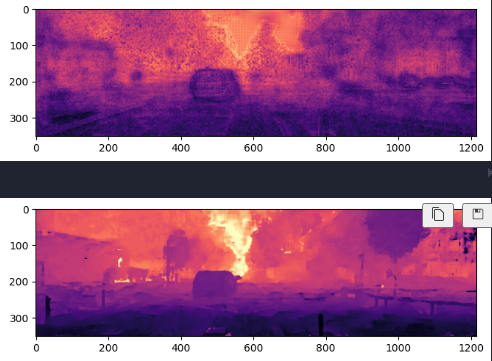

# Depth-Estimation-Task
This project is my implementation of a Lightweight Depth Estimation Model from scratch in Pytorch following the architecture provided this [ICLR paper](https://ieeexplore.ieee.org/document/9411998).

It's using the frozen [MobileNetV2](https://github.com/d-li14/mobilenetv2.pytorch) encoder and trains a Decoder composed of [Inverted Residual](https://ieeexplore.ieee.org/document/8578572) Blocks from the MobileNetV2 network. A U-net style architecture is followed. 
### Model Architecture

### Datasets and Training:
- Training was done on an HP-Omen Laptop with RTX 4060 GPU.
- Due to limited compute resources I am using low-resolution version of the KITTI and CityScapes dataset.
- Download the datasets:
    - [KITTI](https://www.kaggle.com/datasets/utsabkaran/kitti-data)
    - [CityScapes](https://www.kaggle.com/datasets/sakshaymahna/cityscapes-depth-and-segmentation)

### Training Loss on KITTI

### Ground Truth vs Predicted Disparity

## TO-DOs:
 - Improve accuracy and segmentation.
 - Compare with benchmark models like MonoDepth2
 - Try which different loss functions to reduce noise and smoothen output.
 - Improve Segmentation and fix the visualisation